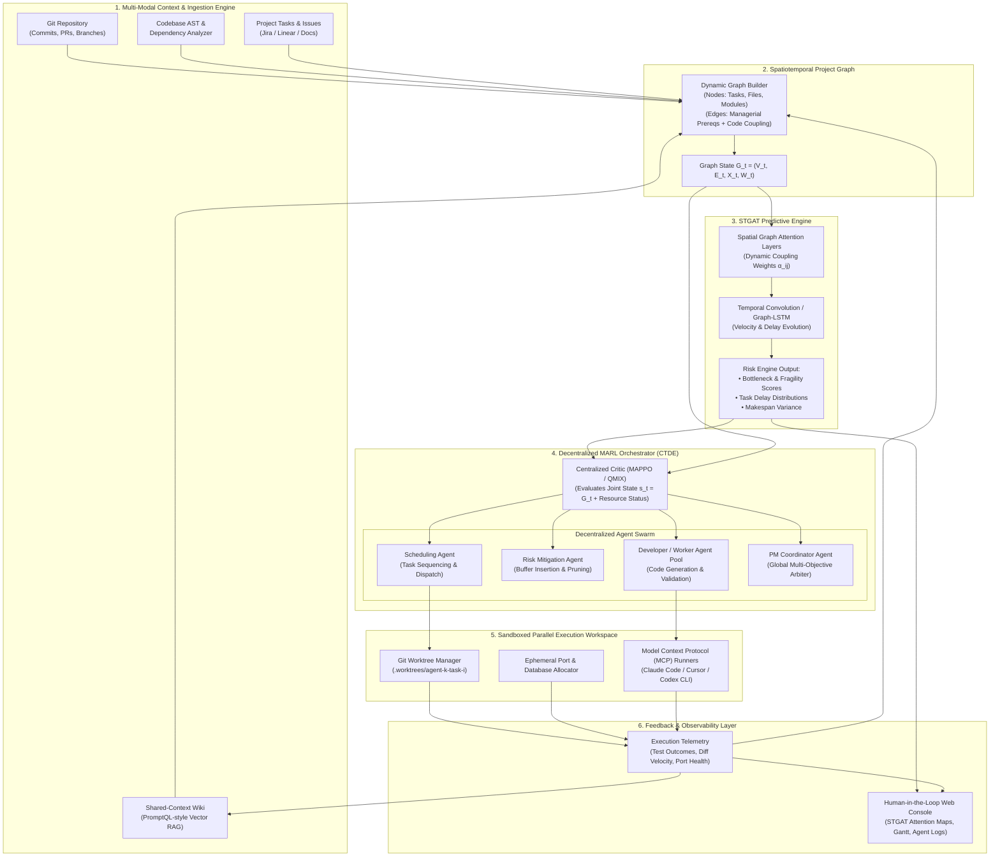
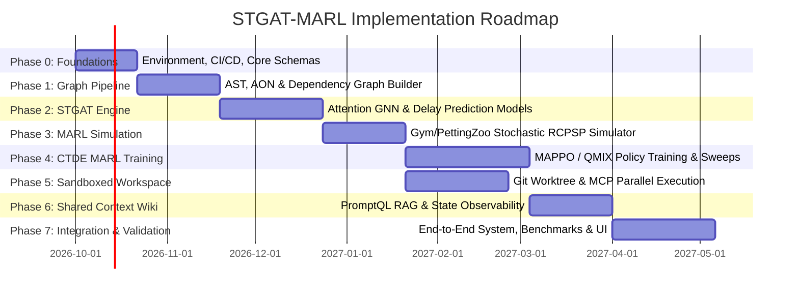
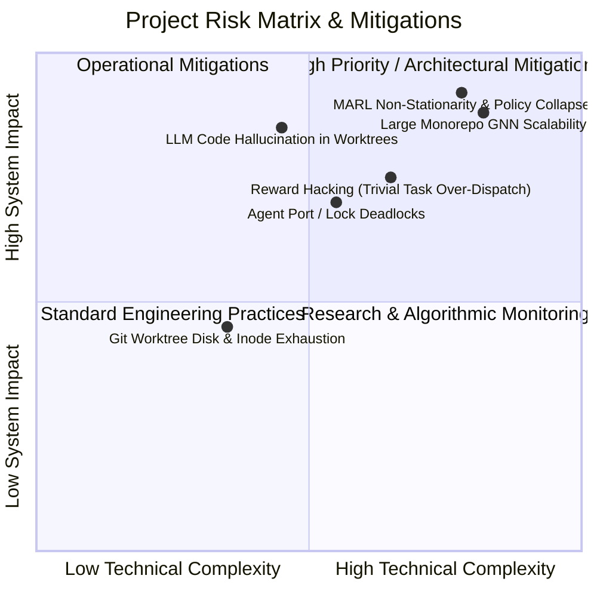

# Intelligent Technical Project Management & Dynamic Scheduling System
## Comprehensive Implementation Plan: STGAT-MARL Autonomous Orchestration Framework

---

### Executive Summary

Modern software engineering is transitioning from single-turn code generation assistants to swarms of autonomous coding agents executing in parallel. However, traditional project management paradigms (static Gantt charts, manual Jira boards, Linear issue tracking, CPM/PERT heuristics) are fundamentally incapable of orchestrating this parallelized, stochastic environment. They suffer from:
1. **Context Fragmentation:** Knowledge silos across Slack, PRs, and issues leave agents context-blind.
2. **Resource & Execution Collisions:** Uncoordinated parallel agents produce merge conflicts, port collisions, and corrupted shared states.
3. **Rigid Static Scheduling (The Stochastic RCPSP Dilemma):** Unforeseen technical hurdles break deterministic schedules, leading to cascading delays.
4. **Spatiotemporal Dependency Blindness:** Managers cannot see how low-level Abstract Syntax Tree (AST) coupling and module dependencies propagate delays across the project topology.

This implementation plan outlines the engineering roadmap to build the **STGAT-MARL Project Management System**—an AI-native operating system that marries **Spatiotemporal Graph Attention Networks (STGAT)** with **Multi-Agent Reinforcement Learning (MARL)** operating over **sandboxed Git worktree workspaces** and a **PromptQL-inspired shared-context wiki**.

---

## 1. System Vision & Architecture

The architecture unifies predictive structural modeling with autonomous decentralized execution:



---

## 2. Mathematical Foundations & Formulations

### 2.1 Spatiotemporal Project Graph $G_t$

At any discrete time step $t \in \{0, 1, \dots, T\}$, the project state is formalized as a directed attributed spatiotemporal graph:
$$G_t = (V_t, E_t, \mathbf{X}_t, \mathbf{W}_t)$$

- **Node Set $V_t$:** Represents heterogeneous project entities:
  $$V_t = V_t^{\text{task}} \cup V_t^{\text{module}} \cup V_t^{\text{artifact}} \cup V_t^{\text{agent}}$$
- **Edge Set $E_t$:** Captures two fundamental classes of connectivity:
  1. *Explicit Managerial Dependencies ($E^{\text{man}}$):* Traditional Activity-On-Node (AON) precedence constraints ($v_i$ must complete before $v_j$ can start).
  2. *Implicit Codebase Dependencies ($E^{\text{code}}$):* Architectural coupling extracted from Abstract Syntax Trees (function call graphs, class inheritance, import topologies) and historical commit co-change frequencies ($v_i$ modifies module $M_1$ which is tightly coupled to module $M_2$ modified by $v_j$).
- **Node Feature Matrix $\mathbf{X}_t \in \mathbb{R}^{|V_t| \times d}$:** For each task node $v_i$, the feature vector $\mathbf{x}_i^t$ encapsulates:
  $$\mathbf{x}_i^t = \left[ d_i^{\text{est}}, d_i^{\text{elapsed}}, c_i^{\text{cyclo}}, s_i^{\text{status}}, \mathbf{r}_i^{\text{skill}}, p_i^{\text{fail}}, \mathbf{e}_i^{\text{AST}} \right]$$
  where $d_i^{\text{est}}$ is estimated duration, $d_i^{\text{elapsed}}$ is elapsed duration, $c_i^{\text{cyclo}}$ is cyclomatic complexity of impacted code, $s_i^{\text{status}}$ is one-hot execution status (pending, in-progress, blocked, completed, failed), $\mathbf{r}_i^{\text{skill}}$ is required agent capability embedding, $p_i^{\text{fail}}$ is historical test failure rate, and $\mathbf{e}_i^{\text{AST}}$ is the code semantic embedding.

### 2.2 Spatiotemporal Graph Attention Network (STGAT) Formulation

#### Spatial Dimension (Graph Attention Mechanism)
For any node $v_i \in V_t$ and its localized in-neighborhood $\mathcal{N}_i = \{v_j \in V_t : (v_j, v_i) \in E_t\}$, the spatial attention coefficient $\alpha_{ij}^t$ quantifies the dynamic coupling risk:

$$\alpha_{ij}^t = \frac{\exp\left( \text{LeakyReLU}\left( \mathbf{a}^T \left[ \mathbf{W}_s \mathbf{h}_i^t \,\|\, \mathbf{W}_s \mathbf{h}_j^t \,\|\, \mathbf{W}_e \mathbf{e}_{ij}^t \right] \right) \right)}{\sum_{k \in \mathcal{N}_i} \exp\left( \text{LeakyReLU}\left( \mathbf{a}^T \left[ \mathbf{W}_s \mathbf{h}_i^t \,\|\, \mathbf{W}_s \mathbf{h}_k^t \,\|\, \mathbf{W}_e \mathbf{e}_{ik}^t \right] \right) \right)}$$

where $\mathbf{W}_s \in \mathbb{R}^{d' \times d}$ is a learnable linear transformation, $\mathbf{e}_{ij}^t$ is the edge attribute vector (e.g., number of inter-module function calls, shared lines of code, git co-churn), $\mathbf{W}_e$ is the edge weight projection, and $\|$ denotes vector concatenation.

With multi-head attention ($K$ heads), the spatial aggregation becomes:
$$\mathbf{z}_i^t = \Vert_{k=1}^K \sigma \left( \sum_{j \in \mathcal{N}_i} \alpha_{ij}^{t,(k)} \mathbf{W}_s^{(k)} \mathbf{h}_j^t \right)$$

#### Temporal Dimension (Gated Temporal Convolution / Graph-LSTM)
Temporal dynamics (velocity of task completion, bug arrival rates, delay spikes) are captured across historical window $H$:
$$\mathbf{H}_i^t = \text{Graph-LSTM}\left( \mathbf{z}_i^t, \mathbf{H}_i^{t-1} \right) \quad \text{or} \quad \mathbf{H}_i^t = \text{GatedTCN}\left( [\mathbf{z}_i^{t-H+1}, \dots, \mathbf{z}_i^t] \right)$$

The predictive head outputs:
1. **Task Delay Probability Distribution:** $\hat{P}(\Delta d_i^t) \sim \mathcal{N}(\mu_i^t, (\sigma_i^t)^2)$
2. **Structural Fragility Score:** $\Phi(v_i) = \sum_{j \in \text{Succ}(i)} \alpha_{ji}^t \cdot \mu_i^t$
3. **Project Makespan Distribution:** $\hat{M}_t = \mathbb{E}[\text{CriticalPath}(G_t | \hat{\mathbf{D}}_t)]$

---

### 2.3 Stochastic RCPSP via Dec-POMDP MARL Formulation

The orchestration problem is modeled as a Decentralized Partially Observable Markov Decision Process (Dec-POMDP) defined by $\langle \mathcal{N}, \mathcal{S}, \{\mathcal{A}_i\}, \mathcal{P}, \{\mathcal{R}_i\}, \{\Omega_i\}, \mathcal{O}, \gamma \rangle$:

1. **Agents $\mathcal{N} = \{A_{\text{sched}}, A_{\text{risk}}, A_{\text{dev}}^{(1 \dots M)}, A_{\text{pm}}\}$:**
   - **Scheduling Agent ($A_{\text{sched}}$):** Selects which task $v_i \in V_{\text{ready}}$ is assigned to which resource/worker agent at each dispatch step.
   - **Risk Agent ($A_{\text{risk}}$):** Injects dynamic time buffers on fragile paths, prioritizes pre-merge verification, or triggers early branch rebasing.
   - **Developer Agents ($A_{\text{dev}}^{(m)}$):** Worker agents controlling individual worktrees; chooses code-generation strategy, test generation intensity, or pre-flight sanity checks.
   - **PM Coordinator ($A_{\text{pm}}$):** Macro-level meta-controller that arbitrates between speed and reliability, tuning reward trade-off weights.

2. **Centralized Training with Decentralized Execution (CTDE):**
   - **Central Critic:** Observes full global state $S_t = \{G_t, \mathbf{R}_t, \mathbf{\Omega}_{\text{infra}}\}$ where $\mathbf{R}_t$ is current resource occupancy and $\mathbf{\Omega}_{\text{infra}}$ is infrastructure health.
   - **Decentralized Policies:** Each agent $i$ acts conditioned on its local observation $o_i^t = \mathcal{O}(S_t, i)$ via policy $\pi_{\theta_i}(a_i^t | o_i^t)$.

3. **Multi-Objective Global Reward Function:**
   $$R_t = \lambda_1 R_{\text{makespan}} + \lambda_2 R_{\text{risk}} + \lambda_3 R_{\text{conflict}} + \lambda_4 R_{\text{idle}} + \lambda_5 R_{\text{quality}}$$
   - $R_{\text{makespan}} = -(M_t - M_{t-1}) - \beta \cdot \mathbb{I}(t > T_{\text{deadline}})$: Penalizes makespan expansion.
   - $R_{\text{risk}} = -\sum_{i \in V_t} \Phi(v_i)$: Minimizes cumulative structural fragility.
   - $R_{\text{conflict}} = -\kappa \cdot N_{\text{merge\_conflicts}}$: Penalizes git collisions and merge disputes.
   - $R_{\text{idle}} = -\sum_m \mathbb{I}(\text{Agent}_m \text{ is idle while } |V_{\text{ready}}| > 0)$: Maximizes parallel compute utilization.
   - $R_{\text{quality}} = \rho \cdot N_{\text{tests\_passed}} - \psi \cdot N_{\text{regressions}}$: Rewards verified green builds.

---

## 3. Technology Stack & Component Specifications

| Subsystem | Framework / Technology | Purpose & Rationale |
|:---|:---|:---|
| **Graph Processing & GNNs** | PyTorch 2.4+, PyTorch Geometric (PyG), DGL | High-performance dynamic graph message passing and heterogeneous graph batching. |
| **AST & Code Analysis** | Tree-sitter, Python `ast`, GitPython, libgit2 | Multi-language AST parsing, call-graph extraction, and commit co-churn history mining. |
| **MARL Framework** | Ray 2.35+ (RLlib), PettingZoo, Gymnasium | Industrial-grade CTDE algorithms (MAPPO, MADDPG, QMIX), distributed experience sampling. |
| **Optimization Baselines** | OR-Tools, SCIP, NetworkX (CPM/PERT) | Classical benchmark solvers for exact and heuristic RCPSP comparison. |
| **Shared Context / Memory** | Qdrant / ChromaDB, LlamaIndex, LiteLLM | PromptQL-style organizational memory layer, semantic caching, vector RAG. |
| **Parallel Execution** | Git Worktrees, Docker, tmux / subprocess | Isolated parallel agent development environments; zero-conflict branches. |
| **Agent CLI Interface** | Model Context Protocol (MCP) SDK, Anthropic Claude Code, OpenAI API | Standardized tool calling and agent action dispatch. |
| **Observability & Dashboards**| FastAPI, React + Vite, WebSockets, TensorBoard, WandB | Real-time graph visualization, attention heatmaps, Gantt tracking, live agent terminals. |

---

## 4. Detailed Implementation Phases

The project is structured into **8 logical phases** spanning a complete engineering cycle.



---

### Phase 0: Infrastructure Setup, Tooling & Foundations (Weeks 1–3)
**Objective:** Establish developer tooling, repository architecture, dependency management, CI/CD pipelines, and mathematical domain models.

#### Key Work Items:
1. **Repository & Workspace Initialization:**
   - Establish monorepo structure separating graph modeling, RL policies, execution runtimes, and dashboards.
   - Configure Python 3.11+ environment with strict type checking (`mypy --strict`), formatting (`ruff`, `black`), and linting.
2. **CI/CD & Smoke Testing Pipeline:**
   - Setup GitHub Actions / GitLab CI for automated unit testing, synthetic graph generation smoke tests, and GPU docker build tests.
   - Configure pre-commit hooks for AST verification and git credential isolation.
3. **Core Domain Data Schemas (Pydantic v2):**
   - Implement schemas for `TaskNode`, `CodebaseModuleNode`, `DependencyEdge`, `AgentState`, `ProjectGraphState`, and `SchedulingAction`.

#### Deliverables:
- Initialized clean repository with Dockerfiles (CUDA-enabled PyTorch + Ray RLlib).
- Core schema package: `project_marl.core.schemas`.
- Passing CI pipeline with 90%+ code coverage for baseline data structures.

---

### Phase 1: Codebase Parsing & Spatiotemporal Graph Construction (Weeks 4–7)
**Objective:** Transform raw codebases and project task specifications into unified dynamic attributed graphs.

#### Key Work Items:
1. **Tree-Sitter Multi-Language AST Extraction Engine:**
   - Build AST extractors for Python, TypeScript/JavaScript, and Go using Tree-sitter.
   - Extract function call graphs, class inheritance trees, module imports, and calculate cyclomatic complexity per function/file.
2. **Git Commit Co-Churn & Historical Coupling Analyzer:**
   - Ingest git commit logs over the last $N$ commits.
   - Compute co-change matrix $C_{ij}$ representing how frequently module $i$ and module $j$ were modified in the same pull request.
3. **Managerial Dependency Parser:**
   - Ingest project tasks from structured specs (JSON/YAML, GitHub Issues, Jira export).
   - Formulate explicit Activity-On-Node (AON) DAG with predecessor/successor relationships, required skill tags, and duration estimates.
4. **Unified Graph Synthesis Layer:**
   - Map tasks to the code modules they modify ($V^{\text{task}} \leftrightarrow V^{\text{module}}$ bipartite edges).
   - Construct PyTorch Geometric `HeteroData` object containing explicit dependencies and weighted implicit code coupling edges.

#### Deliverables:
- Parser module: `project_marl.graph.ast_parser` and `project_marl.graph.git_miner`.
- Graph synthesis engine: `project_marl.graph.builder.ProjectGraphBuilder`.
- Test suite validating graph construction on real-world open-source repositories (e.g., FastAPI, Flask).

---

### Phase 2: Spatiotemporal Graph Attention Network (STGAT) Predictive Engine (Weeks 8–12)
**Objective:** Engineer and train the STGAT model to predict cascading delays, critical path fragility, and project makespans from dynamic graph topologies.

#### Key Work Items:
1. **Spatial Multi-Head Graph Attention (GATv2) Layer:**
   - Implement custom PyG module supporting heterogeneous edge attributes ($\mathbf{e}_{ij}^t$).
   - Compute dynamic attention weights $\alpha_{ij}^t$ highlighting high-coupling risk pathways.
2. **Temporal Modeling Module:**
   - Implement Graph-LSTM and Gated Temporal Convolution (GatedTCN) modules to process sequences of graph snapshots $[G_{t-H+1}, \dots, G_t]$.
   - Ensure causal temporal convolutions prevent future-leakage.
3. **Synthetic Project Dataset Generator:**
   - Build a procedural generator producing thousands of realistic project DAGs with varying topological density, module coupling, and stochastic delay perturbations (log-normal duration distributions).
4. **Model Training & Loss Formulation:**
   - Train STGAT using composite loss:
     $$\mathcal{L} = \mathcal{L}_{\text{delay\_MSE}}(\hat{\mathbf{d}}, \mathbf{d}) + \lambda_{\text{NLL}} \mathcal{L}_{\text{variance\_NLL}} + \lambda_{\text{crit}} \mathcal{L}_{\text{BCE}}(\hat{\mathbf{y}}_{\text{critical}}, \mathbf{y}_{\text{critical}})$$
   - Validate on historical GitHub PR lifecycle datasets and synthetic benchmark suites.

#### Deliverables:
- Neural network module: `project_marl.models.stgat.STGATModel`.
- Training pipeline with MLflow / Weights & Biases logging: `project_marl.training.train_stgat`.
- Checkpointed pretrained STGAT weights exhibiting $>85\%$ accuracy on delay bottleneck prediction.

---

### Phase 3: MARL Simulation Environment & Gymnasium/PettingZoo Integration (Weeks 13–16)
**Objective:** Build a high-throughput, discrete-event simulation environment for the stochastic RCPSP conforming to the PettingZoo Parallel API.

#### Key Work Items:
1. **Stochastic RCPSP Discrete-Event Simulator:**
   - Simulate project time progression where task durations follow stochastic distributions $\tilde{d}_i \sim \text{LogNormal}(\mu_i, \sigma_i^2)$.
   - Simulate external events: developer agent failures, flaky test detections, merge conflict occurrence based on code coupling attention $\alpha_{ij}^t$.
2. **PettingZoo Multi-Agent Environment Wrapper:**
   - Implement `ParallelEnv` interface with distinct observation and action spaces for each agent role:
     - `SchedulingAgent`: Discrete/MultiDiscrete action space selecting eligible task-agent pairings.
     - `RiskAgent`: Continuous/Discrete action injecting buffer days or prioritizing tasks.
     - `DeveloperAgent`: Execution mode (conservative with heavy unit tests vs aggressive fast-commit).
     - `PMAgent`: Weight tuning for reward trade-offs.
3. **Classical Benchmark Baseline Suite:**
   - Implement exact solver using Google OR-Tools / SCIP for static RCPSP.
   - Implement heuristic dispatching rules: Shortest Processing Time (SPT), Longest Processing Time (LPT), Critical Path Method (CPM), Minimum Slack First (MSF).

#### Deliverables:
- Simulation environment: `project_marl.sim.project_env.ProjectSchedulingEnv` (PettingZoo compliant).
- Baseline benchmarks package: `project_marl.baselines.classical_solvers`.
- Verification suite validating environment step dynamics, reset logic, and reward accounting.

---

### Phase 4: Multi-Agent RL Policy Development & CTDE Training (Weeks 17–22)
**Objective:** Train cooperative MARL policies using CTDE algorithms (MAPPO, QMIX, MADDPG) to outperform classical solvers under uncertainty.

#### Key Work Items:
1. **Centralized Critic Architecture:**
   - Build centralized value function $V_{\phi}(S_t)$ taking the global STGAT graph embedding $\mathbf{z}_{\text{global}}^t$ and global resource state $\mathbf{R}_t$.
2. **Decentralized Actor Policies (MAPPO):**
   - Implement Multi-Agent PPO with actor clipping, generalized advantage estimation (GAE), and entropy regularization.
   - Embed role-specific observation encoders (Scheduling, Risk, Dev, PM).
3. **Alternative MARL Algorithmic Baselines:**
   - Implement QMIX for discrete cooperative value decomposition ($Q_{\text{tot}} = f_{\text{mix}}(Q_1, \dots, Q_N; S_t)$).
   - Implement MADDPG for continuous resource allocation settings.
4. **Distributed Scale-Out Training via Ray RLlib:**
   - Configure Ray RLlib cluster rollout workers to sample transitions across hundreds of simulated parallel projects.
   - Conduct hyperparameter sweeps via Ray Tune (learning rate, PPO clip parameter $\epsilon$, GAE $\lambda$, entropy coeff).

#### Deliverables:
- MARL algorithms package: `project_marl.agents.mappo`, `project_marl.agents.qmix`.
- Distributed training script: `project_marl.training.train_marl_ray`.
- Benchmark evaluation report demonstrating MARL policies outperforming CPM/SPT heuristics by $>20\%$ in makespan reduction under $30\%$ stochastic delay variance.

---

### Phase 5: Sandboxed Parallel Execution Workspace (Weeks 23–27)
**Objective:** Build the physical execution layer inspired by Superset, utilizing Git worktrees, isolated database branches, dynamic port routing, and MCP agent runners.

#### Key Work Items:
1. **Automated Git Worktree Lifecycle Manager:**
   - Programmatically spawn isolated git worktrees for each active task: `.worktrees/agent-<id>-task-<task_id>/`.
   - Manage fast branch creation, rebase tracking, and automated merge verification.
2. **Resource Isolation (Ports & Ephemeral DBs):**
   - Dynamic port allocator reserving localhost port blocks per agent (preventing binding collisions).
   - Ephemeral database manager spinning up isolated schema branches (Postgres schema branching or lightweight SQLite instances) per worktree.
3. **Model Context Protocol (MCP) Agent Runner Integration:**
   - Expose workspace tools via MCP: `read_file`, `write_file`, `run_tests`, `git_commit`, `query_ast`.
   - Integrate CLI coding agents (Claude Code, Cursor CLI, custom LLM runners) driven by the Developer Agent policies.
4. **Automated Conflict Resolution Engine:**
   - Pre-merge static analysis testing for AST collisions before git merges are attempted.
   - Early notification to the Scheduling Agent when two branches exhibit overlapping symbol modifications.

#### Deliverables:
- Workspace orchestrator: `project_marl.workspace.worktree_manager`.
- Port and DB isolation layer: `project_marl.workspace.resource_isolator`.
- MCP server interface: `project_marl.workspace.mcp_server`.
- Test harness showing 10+ parallel coding agents modifying different files without collisions.

---

### Phase 6: Shared Context Wiki & Organizational Memory (Weeks 28–31)
**Objective:** Implement the PromptQL-inspired dynamic shared context layer, eliminating knowledge silos and providing full state observability.

#### Key Work Items:
1. **Continuous Documentation & Event Ingestion Pipeline:**
   - Ingest markdown documentation, Architectural Decision Records (ADRs), pull request diffs, code review discussions, and commit messages.
   - Chunk and vectorize content using state-of-the-art embedding models.
2. **Self-Updating Organizational Wiki Graph:**
   - Maintain a dynamic semantic graph connecting concepts, modules, APIs, and business requirements.
   - Automatically generate summaries when a module's public interface is altered in any worktree.
3. **Context Retrieval-Augmented Generation (RAG) Service:**
   - Provide Developer Agents with immediate, deterministic context queries (e.g., *"What is the authentication contract implemented in Task 104?"*).
   - Expose semantic context vectors to the STGAT node feature matrix to enrich task embeddings.

#### Deliverables:
- Memory system: `project_marl.memory.wiki_engine` and `project_marl.memory.vector_store`.
- Semantic state builder: `project_marl.memory.context_injector`.
- Benchmarks verifying query retrieval latency $<100\text{ms}$ with zero stale context hallucinations.

---

### Phase 7: End-to-End Integration, Evaluation & Web Dashboard (Weeks 32–36)
**Objective:** Wire all subsystems into a unified, autonomous orchestration engine with a modern human-in-the-loop visualization dashboard.

#### Key Work Items:
1. **Full-Loop Orchestrator Service:**
   - Ingest high-level software specification $\to$ build dynamic graph $\to$ compute STGAT risk weights $\to$ MARL agents dispatch tasks $\to$ worktrees execute code $\to$ feedback updates graph.
2. **Interactive Operator Dashboard (React + Vite + FastAPI):**
   - **Dynamic Graph & Attention Heatmap:** Visualizes AST and task nodes; edges color-coded by STGAT attention weight $\alpha_{ij}^t$.
   - **Dynamic Gantt Chart:** Live timeline reflecting real-time re-scheduling, task preemption, and critical path projections.
   - **Agent Swarm Monitor:** Live terminal views for each parallel worktree running coding agents.
   - **Human-in-the-Loop Interventions:** UI controls to override agent priorities, inject manual tasks, or resolve edge-case merge disputes.
3. **Comprehensive Ablation Studies & Final Benchmarks:**
   - Ablate STGAT attention (compare against standard GCN and static CPM).
   - Ablate CTDE centralized critic (compare against Independent PPO).
   - Evaluate scalability on graphs up to $N = 1,000$ tasks.

#### Deliverables:
- Complete end-to-end software package: `project_marl.orchestrator`.
- Frontend web dashboard: `project_marl.web_dashboard`.
- Final Evaluation & Benchmark Report with publication-ready charts and ablation tables.

---

## 5. Work Breakdown Structure (WBS) & Deliverables Matrix

| Phase | Milestone Name | Weeks | Key Deliverables | Acceptance Criteria |
|:---:|:---|:---:|:---|:---|
| **P0** | Foundation & Tooling | W1–W3 | Monorepo, Schemas, CI/CD, Dev Containers | 100% test pass on CI, schema validations pass |
| **P1** | Graph Pipeline & Code Miner | W4–W7 | AST parser, Git co-churn miner, HeteroData DAG | Accurately extracts call graphs and co-change weights |
| **P2** | STGAT Predictive Engine | W8–W12 | GATv2 layers, Graph-LSTM, delay prediction model | $>85\%$ accuracy in delay bottleneck identification |
| **P3** | PettingZoo RCPSP Simulator | W13–W16 | Stochastic discrete-event simulator, Baselines | OR-Tools & CPM baselines established; simulation deterministic with fixed seeds |
| **P4** | CTDE MARL Policy Engine | W17–W22 | MAPPO / QMIX policies, Ray distributed training | $>20\%$ makespan reduction vs CPM under uncertainty |
| **P5** | Sandboxed Execution Workspace | W23–W27 | Git worktree orchestrator, MCP runners | 10+ concurrent agents with 0 port/db collisions |
| **P6** | Shared Context Wiki | W28–W31 | Vector RAG memory, self-updating wiki | $<100\text{ms}$ context retrieval, 0 stale hallucinations |
| **P7** | System Integration & Dashboard | W32–W36 | FastAPI backend, React dashboard, Ablations | Complete autonomous project execution cycle demonstrated |

---

## 6. Risk Analysis & Mitigation Strategies



### Risk Mitigation Protocols

1. **MARL Non-Stationarity & Multi-Agent Credit Assignment:**
   - *Risk:* Multiple agents updating policies concurrently destabilize environment dynamics, leading to policy divergence.
   - *Mitigation:* Employ Centralized Training with Decentralized Execution (CTDE) via MAPPO; use counterfactual baselines (COMA-style advantage calculation) to assign precise credit to individual scheduling and risk actions.
2. **Scalability of STGAT on Large Codebases (10k+ Files):**
   - *Risk:* Full-graph attention mechanisms incur quadratic memory complexity $\mathcal{O}(|V|^2)$, causing GPU Out-Of-Memory (OOM) on large enterprise monorepos.
   - *Mitigation:* Implement neighborhood sampling (NeighborLoader in PyG), subgraph clustering (Cluster-GCN), and hierarchical graph pooling (collapsing individual function nodes into module-level macro-nodes).
3. **LLM Code Hallucination & Worktree Poisoning:**
   - *Risk:* Autonomous developer agents produce invalid code, syntax errors, or broken builds that corrupt the branch.
   - *Mitigation:* Strict sandboxing; automated pre-commit hooks run unit tests, type checks, and linters inside the worktree before any commit or merge proposal is registered back to the main branch.
4. **Agent Resource Collisions & Port Exhaustion:**
   - *Risk:* Dozens of parallel microservice tasks contend for fixed ports or shared local databases.
   - *Mitigation:* Deterministic dynamic port ranges assigned via an atomic port lease manager; isolated ephemeral database instances (SQLite or Dockerized temporary schemas).
5. **Reward Hacking in Reinforcement Learning:**
   - *Risk:* Scheduling agent learns to dispatch trivial tasks rapidly to harvest short-term throughput rewards while starving critical path items.
   - *Mitigation:* Incorporate terminal makespan penalties, critical-path weight multipliers, and structural risk penalties ($\Phi(v_i)$) computed directly from the STGAT attention output.

---

## 7. Ethical, Legal, and Operational Governance

1. **Safety Constraints (Safe RL):**
   - The system enforces hard deterministic guardrails outside the RL policy: no agent is permitted to force-push git branches, bypass automated test suites, or alter security-critical files without explicit human sign-off.
2. **Human-in-the-Loop Oversight:**
   - STGAT attention weights natively expose the *rationale* behind scheduling decisions (e.g., *"Task 42 was prioritized because it shares 14 structural call paths with the Authentication Engine"*). Operators can adjust schedule thresholds or pause execution at any time.
3. **Data Privacy & Intellectual Property:**
   - When ingesting enterprise codebases and historical issues, all PII (emails, author names) and API keys are redacted via local regex and token sanitizers prior to vector embedding generation.
4. **Software Licensing Compliance:**
   - All third-party tools and libraries used (PyG, Ray, PettingZoo, Tree-sitter) operate under permissive licenses (Apache 2.0, MIT, BSD). Worktree orchestrator modules adhere to clean architectural separation.

---

## 8. Directory Structure of the Target Codebase

```
project-marl/
├── .github/                      # CI/CD workflows and linting checks
├── configs/                      # Configuration management (Hydra / YAML)
│   ├── env/                      # RCPSP simulation environment configs
│   ├── model/                    # STGAT architecture hyperparameters
│   ├── rl/                       # MAPPO / QMIX algorithm configs
│   └── workspace/                # Worktree and port allocation configs
├── src/
│   └── project_marl/
│       ├── core/                 # Common schemas, types, and logging
│       │   ├── schemas.py        # Pydantic data models for nodes, edges, actions
│       │   └── constants.py
│       ├── graph/                # Spatiotemporal Graph Construction
│       │   ├── ast_parser.py     # Tree-sitter AST & call graph extraction
│       │   ├── git_miner.py      # Git history & co-churn analysis
│       │   ├── aon_builder.py    # Activity-On-Node managerial DAG builder
│       │   └── builder.py        # Unified HeteroData builder
│       ├── models/               # Graph Neural Network Models
│       │   ├── gat_layers.py     # Custom edge-attributed GATv2 layers
│       │   ├── temporal_net.py   # Graph-LSTM / GatedTCN modules
│       │   └── stgat.py          # Unified STGAT predictive network
│       ├── sim/                  # Discrete-Event Simulation Environment
│       │   ├── engine.py         # Stochastic RCPSP simulator core
│       │   ├── pet_env.py        # PettingZoo ParallelEnv wrapper
│       │   └── generator.py      # Procedural project DAG generator
│       ├── agents/               # Multi-Agent Reinforcement Learning
│       │   ├── mappo.py          # Multi-Agent PPO implementation
│       │   ├── qmix.py           # QMIX value decomposition network
│       │   ├── critics.py        # Centralized critic network
│       │   └── policies.py       # Specialized decentralized actor policies
│       ├── workspace/            # Parallel Sandboxed Execution Layer
│       │   ├── worktree_mgr.py   # Git worktree lifecycle management
│       │   ├── port_allocator.py # Atomic port lease manager
│       │   ├── db_isolator.py    # Ephemeral database branching
│       │   └── mcp_runner.py     # Model Context Protocol CLI runner
│       ├── memory/               # PromptQL-Style Shared Context Wiki
│       │   ├── vector_store.py   # Qdrant / ChromaDB vector interface
│       │   ├── wiki_graph.py     # Dynamic organizational context graph
│       │   └── rag_service.py    # Sub-100ms semantic context retriever
│       └── orchestrator/         # End-to-End Orchestration Controller
│           ├── coordinator.py    # Global execution loop
│           └── api.py            # FastAPI backend service
├── web/                          # Human-in-the-Loop Web Dashboard
│   ├── src/
│   │   ├── components/           # Graph visualizer, Gantt chart, Terminals
│   │   └── App.tsx
│   └── package.json
├── tests/                        # Comprehensive unit & integration tests
├── scripts/                      # Training, evaluation, and benchmark runners
├── pyproject.toml                # Build system & dependencies
└── README.md                     # Project documentation & quickstart
```

---

## 9. Conclusion & Immediate Next Steps

This implementation plan provides the complete, mathematically grounded, and systemically phased blueprint for delivering the **STGAT-MARL Intelligent Project Management System**. By bridging Operations Research (RCPSP), Graph Representation Learning (STGAT), Multi-Agent Reinforcement Learning (CTDE via MAPPO), and state-of-the-art sandboxed developer tooling (Git worktrees, PromptQL memory), this system overcomes the critical bottlenecks of modern AI-assisted engineering.

### Recommended Immediate Actions:
1. Initialize the monorepo structure and Docker execution environment according to Section 8.
2. Implement the core Pydantic domain schemas (`TaskNode`, `CodebaseModuleNode`, `DependencyEdge`) as defined in Phase 0.
3. Configure the Tree-sitter AST extraction engine to process the initial sample repositories as outlined in Phase 1.
